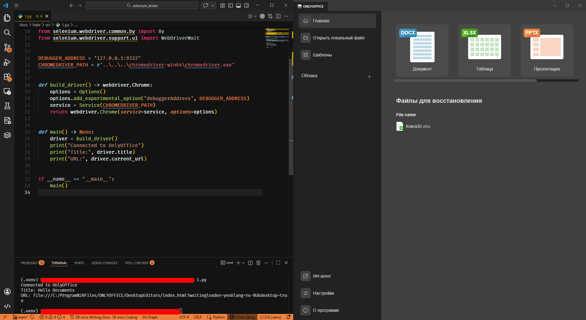
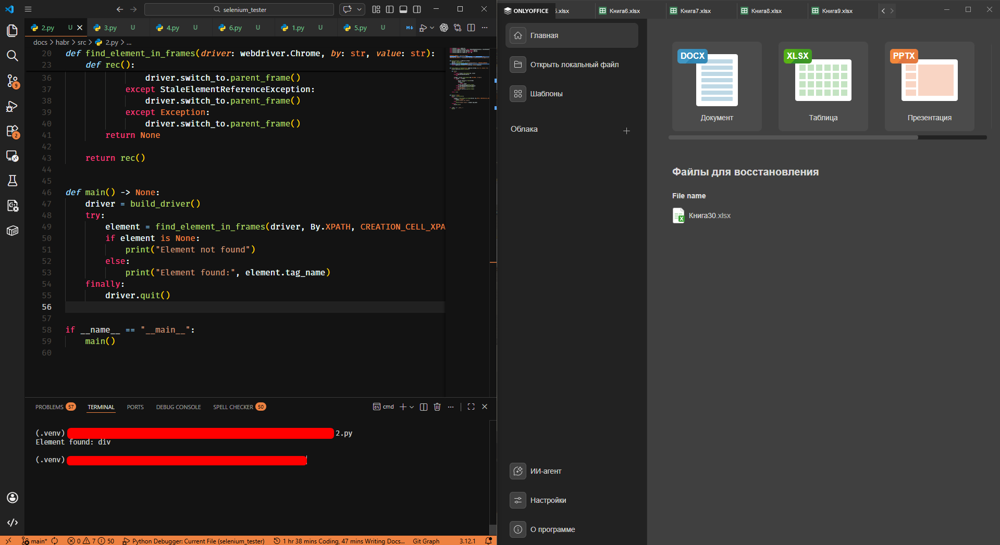
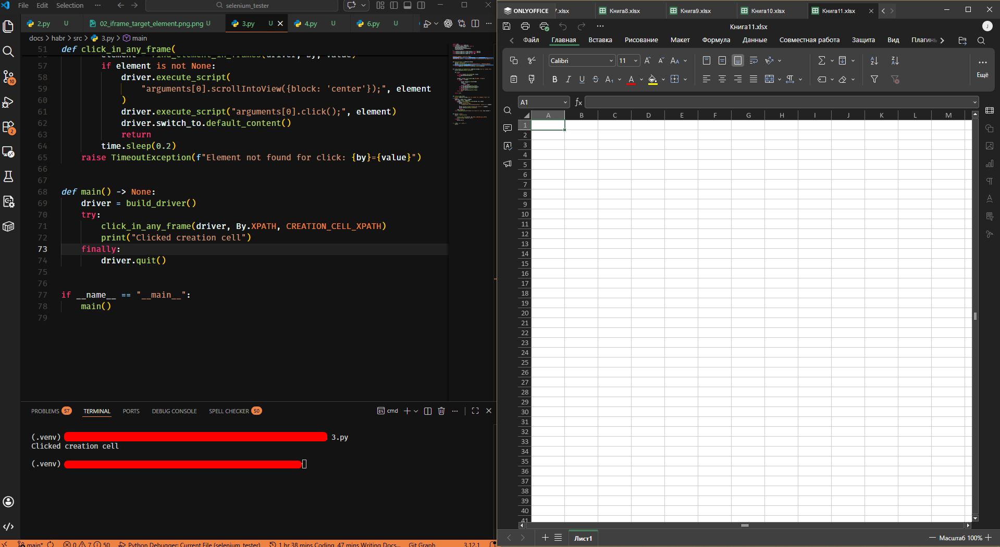
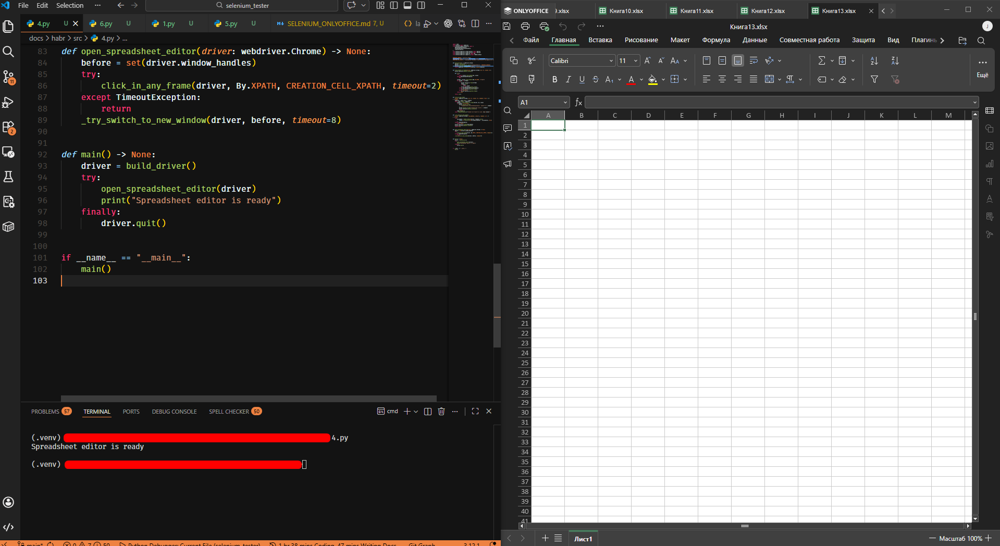
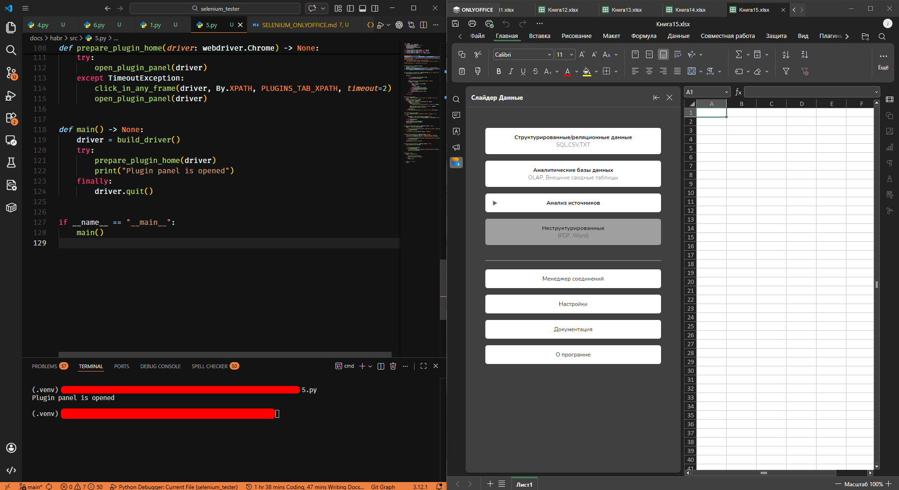
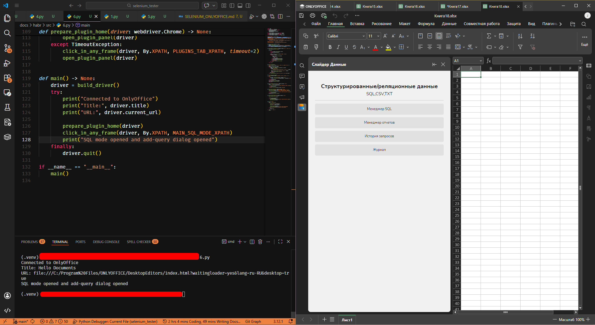

# Selenium + OnlyOffice: практический шаблон автотеста на Python

В этом материале представлен практический шаблон автоматизации сценариев OnlyOffice Desktop Editors с использованием Selenium.  
Статья оформлена как пошаговое руководство: от подготовки окружения до полного исполняемого скрипта.

## Введение

При работе с плагинами OnlyOffice значительная часть регрессионной проверки нередко выполняется вручную: открытие документа, запуск плагина, переход в SQL-раздел, выполнение действий в интерфейсе и валидация результата.  
С ростом количества сценариев такой подход становится трудозатратным и снижает воспроизводимость тестирования.

Использование Selenium в связке с `--remote-debugging-port` позволяет подключаться к уже запущенному экземпляру Desktop Editors и автоматизировать UI-поток в условиях, максимально близких к пользовательским.  
Практическая ценность такого подхода:

- воспроизводимый и стандартизированный запуск e2e-сценариев;
- стабильная работа с интерфейсом плагина, построенным на вложенных `iframe`;
- раннее выявление регрессий в SQL Manager и связанных экранах;
- снижение объема ручных повторных проверок.

Цель статьи — показать минимальный, но практически применимый каркас автоматизации, который можно использовать как основу для дальнейшего расширения тестового набора.

## Цели материала

1. Рабочий скрипт подключения к уже открытому экземпляру OnlyOffice.
2. Готовые helper-функции для клика и ввода через вложенные `iframe`.
3. Базовый сценарий SQL Manager (переход в режим и создание запроса).
4. Шаблон, пригодный для адаптации под проектные тест-кейсы.

## Структура материала

1. Требования и подготовка окружения.
2. Запуск OnlyOffice с remote debugging.
3. Подключение Selenium к Desktop-процессу.
4. Работа с `iframe` и надежные клики/ввод.
5. Пример end-to-end сценария.
6. Полный код для запуска.
7. Набор скриншотов, которые стоит добавить в публикацию.

## Предварительные требования

1. Windows и установленный OnlyOffice Desktop Editors.
2. Python 3.10+.
3. Selenium: `pip install selenium`.
4. Совместимый `chromedriver` для встроенного Chromium в вашей версии OnlyOffice.
   > Примечание: на момент написания статьи нужная версия chromedriver `109.0.5414.74`

Если версии Chromium и `chromedriver` не совпадают, вы получите `SessionNotCreatedException`.

## Шаг 1. Подготовка окружения

```powershell
python -m venv .venv
.\.venv\Scripts\Activate.ps1
python -m pip install --upgrade pip
pip install selenium
```

В скрипте нужно явно указать путь к `chromedriver.exe`:

```python
CHROMEDRIVER_PATH = r"<путь до драйвера>"
```

Используйте фактический абсолютный путь на вашей машине. Если путь неверный, драйвер не запустится.


## Шаг 2. Запуск OnlyOffice с remote debugging

```cmd
"C:\Program Files\ONLYOFFICE\DesktopEditors\DesktopEditors.exe" --remote-debugging-port=9222
```

Дальше Selenium будет подключаться к этому процессу по `127.0.0.1:9222`.


## Импортируем библиотеки

Нужны Selenium-классы, исключения и простой тайминг для polling-ожиданий.

```python
import time
from selenium import webdriver
from selenium.common.exceptions import (
    NoSuchElementException,
    StaleElementReferenceException,
    TimeoutException,
)
from selenium.webdriver.chrome.options import Options
from selenium.webdriver.chrome.service import Service
from selenium.webdriver.common.by import By
from selenium.webdriver.support.ui import WebDriverWait
```

## Функция подключения к OnlyOffice

`build_driver()` не открывает новый Chrome, а подключается к уже открытому OnlyOffice через `debuggerAddress`.

```python
DEBUGGER_ADDRESS = "127.0.0.1:9222"
CHROMEDRIVER_PATH = r"<путь до драйвера>"


def build_driver() -> webdriver.Chrome:
    options = Options()
    options.add_experimental_option("debuggerAddress", DEBUGGER_ADDRESS)
    service = Service(CHROMEDRIVER_PATH)
    return webdriver.Chrome(service=service, options=options)
```



## Поиск и клик в любом iframe

OnlyOffice часто рендерит нужный UI внутри вложенных `iframe`.  
Поэтому делаем рекурсивный обход дерева фреймов.

```python
def find_element_in_frames(driver: webdriver.Chrome, by: str, value: str):
    driver.switch_to.default_content()

    def rec():
        try:
            return driver.find_element(by, value)
        except NoSuchElementException:
            pass

        iframes = driver.find_elements(By.TAG_NAME, "iframe")
        for iframe in iframes:
            try:
                driver.switch_to.frame(iframe)
                found = rec()
                if found:
                    return found
                driver.switch_to.parent_frame()
            except StaleElementReferenceException:
                driver.switch_to.parent_frame()
            except Exception:
                driver.switch_to.parent_frame()
        return None

    return rec()
```



## Надежный клик с timeout

`click_in_any_frame(...)` добавляет polling-ожидание.

```python
def click_in_any_frame(
    driver: webdriver.Chrome, by: str, value: str, timeout: float = 15
) -> None:
    deadline = time.time() + timeout
    while time.time() < deadline:
        element = find_element_in_frames(driver, by, value)
        if element is not None:
            driver.execute_script(
                "arguments[0].scrollIntoView({block: 'center'});", element
            )
            driver.execute_script("arguments[0].click();", element)
            return
        time.sleep(0.2)
    raise TimeoutException(f"Element not found for click: {by}={value}")
```

На этапе третьего примера сначала открываем табличный редактор простым кликом по стартовой карточке:

```python
CREATION_CELL_XPATH = "//div[@class='document-creation-grid']/div[@data-id='cell']"
click_in_any_frame(driver, By.XPATH, CREATION_CELL_XPATH)
```

Дальше используем более устойчивый вариант `open_spreadsheet_editor(driver)`, где уже есть обработка переключения на новое окно.



## Открытие табличного редактора

Перед кликами по элементам плагина нужно открыть табличный редактор и перейти в актуальное окно, если оно было создано после клика по стартовой карточке.

```python
CREATION_CELL_XPATH = "//div[@class='document-creation-grid']/div[@data-id='cell']"


def _try_switch_to_new_window(
    driver: webdriver.Chrome, old_handles: set[str], timeout: int = 8
) -> bool:
    try:
        new_handle = WebDriverWait(driver, timeout).until(
            lambda d: next(iter(set(d.window_handles) - old_handles), None)
        )
    except TimeoutException:
        return False
    driver.switch_to.window(new_handle)
    driver.switch_to.default_content()
    return True


def open_spreadsheet_editor(driver: webdriver.Chrome) -> None:
    before = set(driver.window_handles)
    try:
        click_in_any_frame(driver, By.XPATH, CREATION_CELL_XPATH, timeout=2)
    except TimeoutException:
        return
    _try_switch_to_new_window(driver, before, timeout=8)
```



## Открытие панели плагина

После открытия таблицы нужно перейти на вкладку плагинов и повторно нажать кнопку плагина, если панель не поднялась с первой попытки.

```python
PLUGINS_TAB_XPATH = "//ul[@role='tablist']/li[@data-layout-name='toolbar-plugins']/a"
PLUGIN_BUTTON_XPATH = (
    "//section[@id='plugins-panel']/div/span/button"
    "[descendant::*[text()='Слайдер'] and descendant::*[text()='Данные']]"
)
STARTUP_CLOSE_XPATH = "//div[@class='tool close']"


def open_plugin_panel(driver: webdriver.Chrome) -> None:
    click_in_any_frame(driver, By.XPATH, PLUGINS_TAB_XPATH, timeout=2)
    click_in_any_frame(driver, By.XPATH, PLUGIN_BUTTON_XPATH, timeout=8)
    try:
        click_in_any_frame(driver, By.XPATH, STARTUP_CLOSE_XPATH, timeout=1)
    except TimeoutException:
        pass
    driver.switch_to.default_content()


def prepare_plugin_home(driver: webdriver.Chrome) -> None:
    open_spreadsheet_editor(driver)

    try:
        open_plugin_panel(driver)
    except TimeoutException:
        # Retry once: toolbar may render with delay right after opening a sheet.
        click_in_any_frame(driver, By.XPATH, PLUGINS_TAB_XPATH, timeout=2)
        open_plugin_panel(driver)
```



## Точка входа сценария

`main()` соединяет все предыдущие функции в один тестовый поток.  
Первый шаг внутри сценария — `prepare_plugin_home(driver)`: он открывает редактор и явно поднимает панель плагина (с одним retry, если тулбар появился с задержкой).

```python
def main() -> None:
    driver = build_driver()
    try:
        print("Connected to OnlyOffice")
        print("Title:", driver.title)
        print("URL:", driver.current_url)

        prepare_plugin_home(driver)
        click_in_any_frame(driver, By.XPATH, MAIN_SQL_MODE_XPATH)
        click_in_any_frame(
            driver, By.CSS_SELECTOR, "[data-testid='sql-manager-add-query-open']"
        )
    finally:
        driver.quit()
```



## Полный код целиком

```python
import time
from selenium import webdriver
from selenium.common.exceptions import (
    NoSuchElementException,
    StaleElementReferenceException,
    TimeoutException,
)
from selenium.webdriver.chrome.options import Options
from selenium.webdriver.chrome.service import Service
from selenium.webdriver.common.by import By
from selenium.webdriver.support.ui import WebDriverWait


DEBUGGER_ADDRESS = "127.0.0.1:9222"
CHROMEDRIVER_PATH = r"<путь до драйвера>"
CREATION_CELL_XPATH = "//div[@class='document-creation-grid']/div[@data-id='cell']"
PLUGINS_TAB_XPATH = "//ul[@role='tablist']/li[@data-layout-name='toolbar-plugins']/a"
PLUGIN_BUTTON_XPATH = (
    "//section[@id='plugins-panel']/div/span/button"
    "[descendant::*[text()='Слайдер'] and descendant::*[text()='Данные']]"
)
STARTUP_CLOSE_XPATH = "//div[@class='tool close']"
MAIN_SQL_MODE_XPATH = "//button[@data-testid='main-sql-mode']"


def build_driver() -> webdriver.Chrome:
    options = Options()
    options.add_experimental_option("debuggerAddress", DEBUGGER_ADDRESS)
    service = Service(CHROMEDRIVER_PATH)
    return webdriver.Chrome(service=service, options=options)


def find_element_in_frames(driver: webdriver.Chrome, by: str, value: str):
    driver.switch_to.default_content()

    def rec():
        try:
            return driver.find_element(by, value)
        except NoSuchElementException:
            pass

        iframes = driver.find_elements(By.TAG_NAME, "iframe")
        for iframe in iframes:
            try:
                driver.switch_to.frame(iframe)
                found = rec()
                if found:
                    return found
                driver.switch_to.parent_frame()
            except StaleElementReferenceException:
                driver.switch_to.parent_frame()
            except Exception:
                driver.switch_to.parent_frame()
        return None

    return rec()


def click_in_any_frame(
    driver: webdriver.Chrome, by: str, value: str, timeout: float = 15
) -> None:
    deadline = time.time() + timeout
    while time.time() < deadline:
        element = find_element_in_frames(driver, by, value)
        if element is not None:
            driver.execute_script(
                "arguments[0].scrollIntoView({block: 'center'});", element
            )
            driver.execute_script("arguments[0].click();", element)
            return
        time.sleep(0.2)
    raise TimeoutException(f"Element not found for click: {by}={value}")


def _try_switch_to_new_window(
    driver: webdriver.Chrome, old_handles: set[str], timeout: int = 8
) -> bool:
    try:
        new_handle = WebDriverWait(driver, timeout).until(
            lambda d: next(iter(set(d.window_handles) - old_handles), None)
        )
    except TimeoutException:
        return False
    driver.switch_to.window(new_handle)
    driver.switch_to.default_content()
    return True


def open_spreadsheet_editor(driver: webdriver.Chrome) -> None:
    before = set(driver.window_handles)
    try:
        click_in_any_frame(driver, By.XPATH, CREATION_CELL_XPATH, timeout=2)
    except TimeoutException:
        return
    _try_switch_to_new_window(driver, before, timeout=8)


def switch_to_new_window(driver: webdriver.Chrome, old_handles: set[str], timeout: int = 10) -> str:
    def _new_handle(d):
        current = set(d.window_handles)
        diff = current - old_handles
        return next(iter(diff), None)

    new_handle = WebDriverWait(driver, timeout).until(_new_handle)
    driver.switch_to.window(new_handle)
    driver.switch_to.default_content()
    return new_handle


def open_plugin_panel(driver: webdriver.Chrome) -> None:
    click_in_any_frame(driver, By.XPATH, PLUGINS_TAB_XPATH, timeout=2)
    click_in_any_frame(driver, By.XPATH, PLUGIN_BUTTON_XPATH, timeout=8)
    try:
        click_in_any_frame(driver, By.XPATH, STARTUP_CLOSE_XPATH, timeout=1)
    except TimeoutException:
        pass
    driver.switch_to.default_content()


def prepare_plugin_home(driver: webdriver.Chrome) -> None:
    open_spreadsheet_editor(driver)

    try:
        open_plugin_panel(driver)
    except TimeoutException:
        click_in_any_frame(driver, By.XPATH, PLUGINS_TAB_XPATH, timeout=2)
        open_plugin_panel(driver)


def main() -> None:
    driver = build_driver()
    try:
        print("Connected to OnlyOffice")
        print("Title:", driver.title)
        print("URL:", driver.current_url)

        prepare_plugin_home(driver)
        click_in_any_frame(driver, By.XPATH, MAIN_SQL_MODE_XPATH)
        click_in_any_frame(
            driver, By.CSS_SELECTOR, "[data-testid='sql-manager-add-query-open']"
        )

        # Пример переключения на новое окно:
        # before = set(driver.window_handles)
        # click_in_any_frame(driver, By.CSS_SELECTOR, "[data-testid='sql-manager-export-confirm']")
        # new_handle = switch_to_new_window(driver, before)
        # print("Switched to:", new_handle)

    finally:
        driver.quit()


if __name__ == "__main__":
    main()
```

## Типовые проблемы

1. `SessionNotCreatedException` - не совпала версия `chromedriver`.
2. `cannot connect to chrome at 127.0.0.1:9222` - OnlyOffice запущен без флага remote debugging или порт занят.
3. `NoSuchElementException` - элемент в другом `iframe`, а поиск идет из неверного контекста.
4. `StaleElementReferenceException` - UI перерисован, нужен повторный поиск элемента.
5. `TimeoutException` на `main-sql-mode` - не открыт табличный редактор или панель плагина не активна; вызовите `prepare_plugin_home(driver)` (он повторно нажимает кнопку плагина, если после первого запуска панель не открылась).
